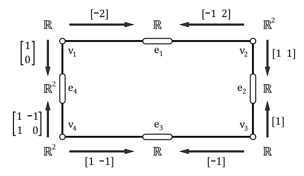

# Sheaf Diffusion Simulation on Graphs

This project implements the sheaf diffusion process described in **Section 5** of the paper [*Opinion Dynamics on Discourse Sheaves*](https://epubs.siam.org/doi/abs/10.1137/20M1341088) by Hansen and Ghrist. The primary goal is to visualize how opinions evolve over time using diffusion dynamics on sheaves defined over a graph. This implementation uses a custom sheaf Laplacian, simulates the diffusion process, and provides tools to animate and visualize the opinion dynamics as the diffusion evolves.

## Project Overview

### 1. **Sheaf Laplacian Construction**
- The sheaf Laplacian $L_F$ is computed using the *coboundary* matrix (denoted as $ \delta$) obtained from the node and edge vector spaces and the corresponding connecting maps.
- Each node and edge in the graph has an associated vector space, and the connecting maps define the linear transformations between these vector spaces.
- For a given graph, the sheaf Laplacian is calculated as:
    
    $$ L_F = \delta^T \delta $$

  where $ \delta $ is a matrix built based on the given graph structure and connecting maps.

### 2. **Diffusion Process Simulation**
- The project simulates the diffusion process governed by the differential equation:

  $$\frac{dx}{dt} = -\alpha L_F x $$

  The exact solution to this equation is given by:

  $$ x(t) = \exp(-t\alpha L_F) x(0)$$

  where $\alpha > 0 $ is a diffusion constant and $ x(0) $ is the initial opinion vector.

- A numerical simulation is performed using explicit Euler time-stepping to approximate the solution over time. The final solution $ x(t) $ as $ t \rightarrow \infty $ is compared to the orthogonal projection of the initial opinion vector onto the kernel of the sheaf Laplacian.

### 3. **Visualization and Animation**
- For graphs where the vector spaces have dimension at most 2, the project provides visualizations for the evolving dynamics:
  - **1D Vector Spaces**: Use grayscale intensity to represent node and edge values.
  - **2D Vector Spaces**: Use RGB color maps to visualize the evolution of opinions on the graph.
- The tool includes a function to generate an animated video of the diffusion process, allowing users to observe how opinions evolve over time.

## File Structure

- **`sheaf_diffusion.py`**: Contains the implementation of the `SheafDiffusion` class, which constructs the sheaf Laplacian and simulates the diffusion dynamics.
- **`sheaf_visualization.py`**: Contains the `SheafDiffusionVisualizer` class for plotting and animating the diffusion process.
- **`README.md`**: Project documentation and overview.
- **`requirements.txt`**: Lists the dependencies required to run the project.

## Getting Started

### Prerequisites

- Python 3.6+
- Required packages listed in `requirements.txt`. Install using:

  ```bash
  pip install -r requirements.txt
  ```

### Running the Project

1. **Construct the Graph and Define Vector Spaces**:
   Define the graph structure, node vector spaces, edge vector spaces, and connecting maps. Here’s an example setup with the picture of the sheaf we are generating below:

   ```python
   graph_structure = {'e1': ('v1', 'v2'), 'e2': ('v2', 'v3'), 'e3': ('v3', 'v4'), 'e4': ('v4', 'v1')}
   node_spaces = {'v1': 1, 'v2': 2, 'v3': 1, 'v4': 2}
   edge_spaces = {'e1': 1, 'e2': 1, 'e3': 1, 'e4': 2}
   connecting_maps = {
       'e1': (np.array([[-2]]), np.array([[-1, 2]])),
       'e2': (np.array([[1, 1]]), np.array([[1]])),
       'e3': (np.array([[-1]]), np.array([[1, -1]])),
       'e4': (np.array([[1, -1], [1, 0]]), np.array([[1], [0]]))
   }
   ```
   

2. **Initialize the Sheaf Diffusion**:
   Create a `SheafDiffusion` instance:

   ```python
   sheaf_diffusion = SheafDiffusion(graph_structure, node_spaces, edge_spaces, connecting_maps)
   ```

3. **Run the Diffusion Process**:
   Specify the initial condition and run the diffusion simulation:

   ```python
   initial_condition = [np.array([1]), np.array([0, 1]), np.array([0]), np.array([1, -1])]
   _, all_states = sheaf_diffusion.run_diffusion(initial_condition, alpha=0.1, dt=0.01, num_timesteps=100)
   ```

4. **Visualize and Animate**:
   Create a `SheafDiffusionVisualizer` instance and generate a video:

   ```python
   visualizer = SheafDiffusionVisualizer(sheaf_diffusion, graph_structure)
   visualizer.animate_diffusion(all_states, filename="sheaf_diffusion.mp4", interval=50)
   ```

## Features

1. **Numerical and Analytical Solutions**:
   - Compares the numerical solution from time-stepping to the analytical solution using matrix exponentiation.
   
2. **Kernel Projection**:
   - Computes the kernel of the sheaf Laplacian and projects the initial condition onto the kernel.
   
3. **Visualization**:
   - Provides 1D and 2D visualizations using grayscale and RGB color maps.

4. **Animation**:
   - Generates an animated video showing how opinions evolve on the graph over time.

## Citation

If you use this code in your work, please cite the original paper:

> Hansen, J., & Ghrist, R. (2021). *Opinion Dynamics on Discourse Sheaves*. SIAM Journal on Applied Algebra and Geometry, 5(2), 315-342. DOI: [10.1137/20M1341088](https://epubs.siam.org/doi/abs/10.1137/20M1341088)

## License

This project is licensed under the MIT License.

## Acknowledgements

This project is based on concepts and methods described in the paper by Hansen and Ghrist. Special thanks to the authors for their insightful work on opinion dynamics on sheaves.
